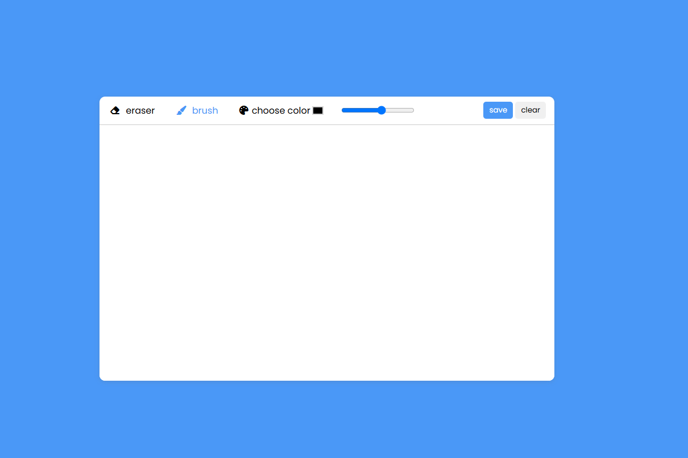

# 🎨 Paint App – Einfaches Zeichenprojekt mit Canvas

Dieses Projekt ist eine kleine **Web-Zeichenanwendung**, erstellt mit **HTML5 Canvas**, **CSS** und **JavaScript**.  
Du kannst mit verschiedenen Farben und Pinselgrößen zeichnen, löschen, das Bild speichern oder das Canvas leeren.

---

## 🚀 Live-Demo

👉 click [hier](https://jafar-alizadeh.github.io/paint-malen/) to see demo

---

## 🖼️ Vorschau

---

## ⚙️ Verwendete Technologien

- **HTML5 Canvas** – zum Zeichnen und Speichern der Linien  
- **CSS3** – für das Layout und Design der Benutzeroberfläche  
- **JavaScript (ES6)** – für alle interaktiven Funktionen wie:
  - Zeichnen mit Mausbewegung  
  - Farbe ändern  
  - Pinselgröße anpassen  
  - Radierer aktivieren  
  - Canvas leeren (`clear`)  
  - Zeichnung speichern (`save`)

---

